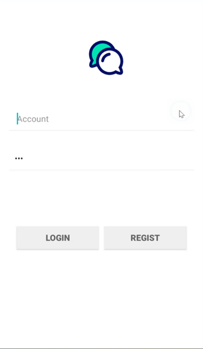
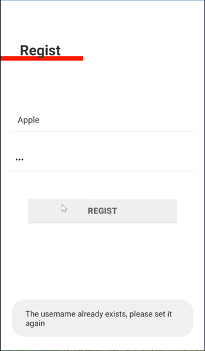
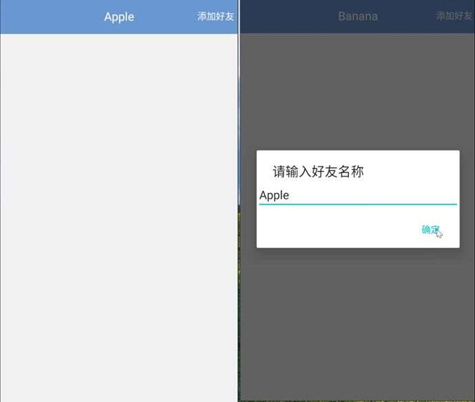
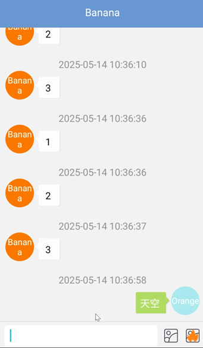
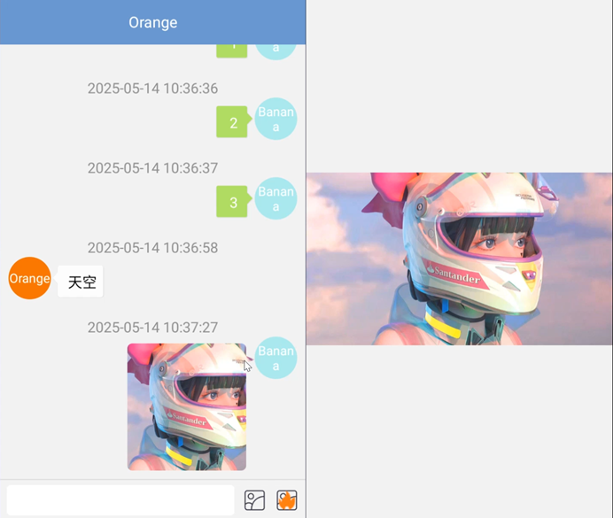
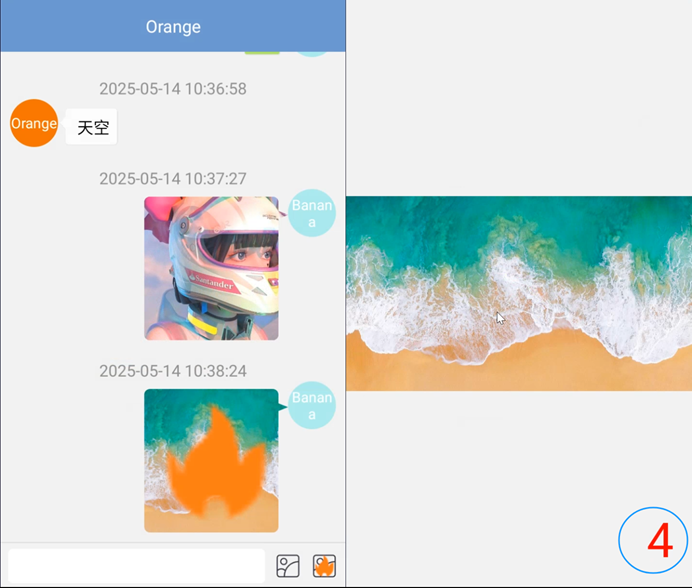
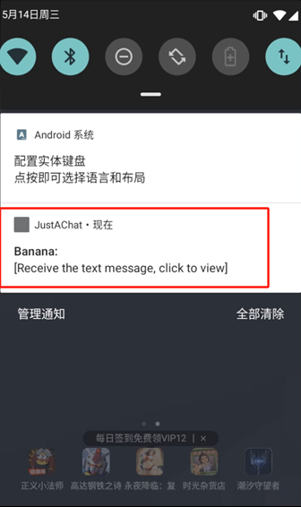

# JustAChat-App
JustAChat Android Application
一个聊天App，基于WebSocket，[移动端代码点这里](https://github.com/superSp/JustAChat-App)。主要功能：
- 登录注册
- 聊天
- 加好友
- 文本消息
- 图片消息
- 阅后即焚图片消息
- 离线消息缓存发送与接收消息
- 支持后台接收消息
- 内容传输AES加密
# 界面如下：

# Aid - buy me a MiXue lemonade 

